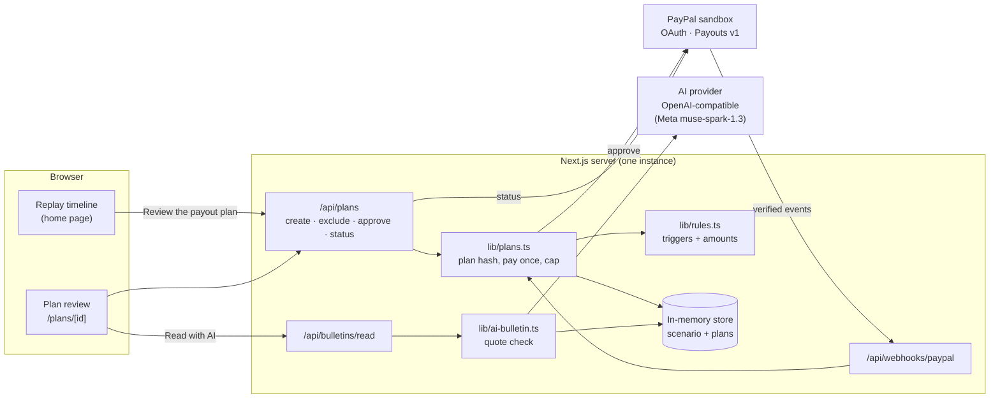
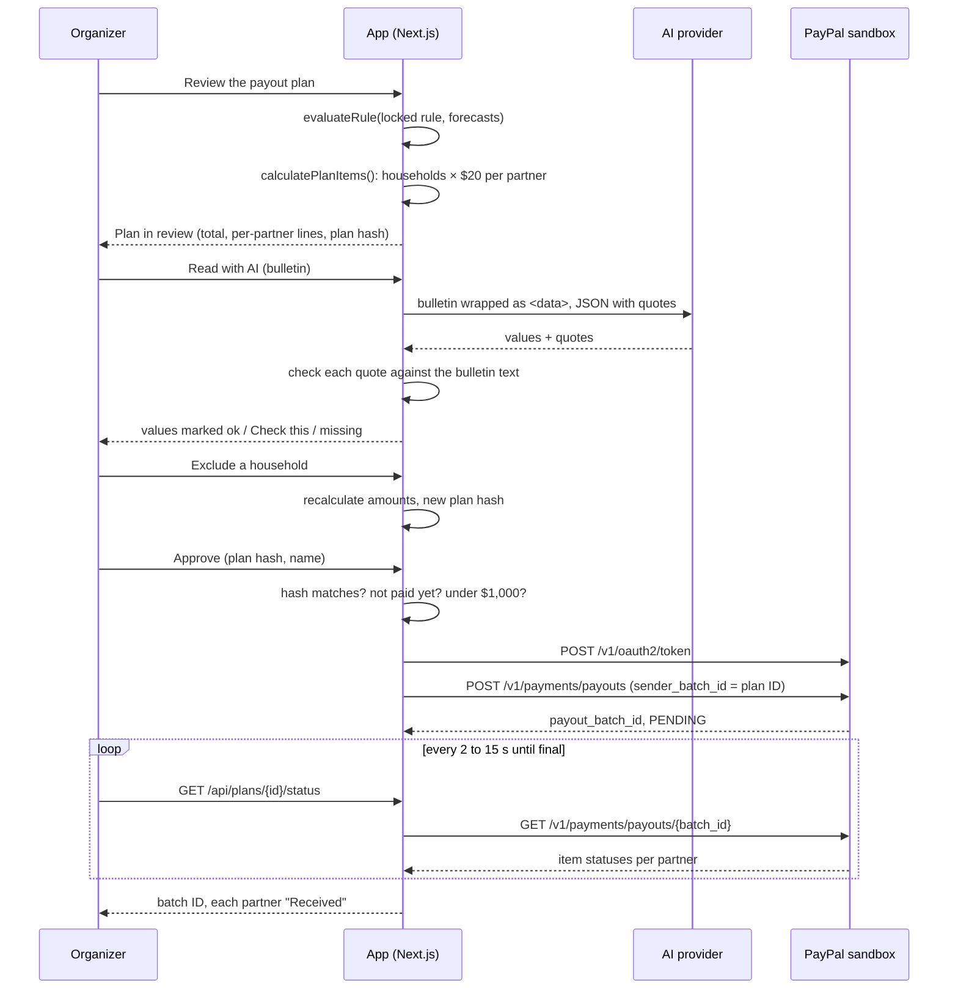
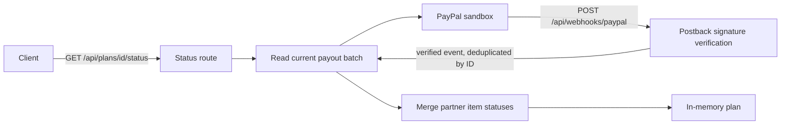

# Architecture

GitHub renders the Mermaid diagrams below.

## Who decides what

The design rule is simple: **AI reads, code decides, a person approves, PayPal pays.**

| Decision | Made by | Where |
| --- | --- | --- |
| Which provinces qualify | Code, from a rule locked before the season | `src/lib/rules.ts` (`evaluateRule`) |
| How much each partner gets | Code: households × fixed amount, integer cents | `src/lib/rules.ts` (`calculatePlanItems`) |
| What a bulletin says | AI, with a verbatim quote per value | `src/lib/ai-bulletin.ts` |
| Whether that quote is real | Code: the quote must appear in the bulletin | `checkReading` in `src/lib/ai-bulletin.ts` |
| Who is left out | A person, with Exclude | `src/lib/plans.ts` (`excludeHousehold`) |
| Whether money moves | A person, once, on the exact plan hash | `src/lib/plans.ts` (`approvePlan`) |
| Sending the money | PayPal Payouts, one batch per plan | `src/lib/paypal.ts` |

`src/lib/rules.ts` imports nothing from the AI modules, so AI output has no path to a threshold or an amount.

## Components

```mermaid
flowchart LR
  subgraph Browser
    Replay["Replay timeline<br/>(home page)"]
    Review["Plan review<br/>/plans/[id]"]
  end
  subgraph Server["Next.js server (one instance)"]
    PlansAPI["/api/plans<br/>create · exclude · approve · status"]
    ReadAPI["/api/bulletins/read"]
    Webhook["/api/webhooks/paypal"]
    Rules["lib/rules.ts<br/>triggers + amounts"]
    Plans["lib/plans.ts<br/>plan hash, pay once, cap"]
    Bulletin["lib/ai-bulletin.ts<br/>quote check"]
    Store[("In-memory store<br/>scenario + plans")]
  end
  LLM["AI provider<br/>OpenAI-compatible<br/>(Meta muse-spark-1.3)"]
  PayPal["PayPal sandbox<br/>OAuth · Payouts v1"]

  Replay -->|Review the payout plan| PlansAPI
  Review --> PlansAPI
  Review -->|Read with AI| ReadAPI
  PlansAPI --> Plans --> Rules
  Plans --> Store
  ReadAPI --> Bulletin --> LLM
  Bulletin --> Store
  Plans -->|approve| PayPal
  PlansAPI -->|status| PayPal
  PayPal -->|verified events| Webhook --> Plans
```

Secrets live only on the server (`src/lib/env.ts`). The browser never sees PayPal or AI keys, partner emails, phone numbers or receipt codes.

## Relief payout flow

```mermaid
sequenceDiagram
  participant O as Organizer
  participant A as App (Next.js)
  participant AI as AI provider
  participant P as PayPal sandbox

  O->>A: Review the payout plan
  A->>A: evaluateRule(locked rule, forecasts)
  A->>A: calculatePlanItems(): households × $20 per partner
  A-->>O: Plan in review (total, per-partner lines, plan hash)
  O->>A: Read with AI (bulletin)
  A->>AI: bulletin wrapped as <data>, JSON with quotes
  AI-->>A: values + quotes
  A->>A: check each quote against the bulletin text
  A-->>O: values marked ok / Check this / missing
  O->>A: Exclude a household
  A->>A: recalculate amounts, new plan hash
  O->>A: Approve (plan hash, name)
  A->>A: hash matches? not paid yet? under $1,000?
  A->>P: POST /v1/oauth2/token
  A->>P: POST /v1/payments/payouts (sender_batch_id = plan ID)
  P-->>A: payout_batch_id, PENDING
  loop every 2 to 15 s until final
    O->>A: GET /api/plans/{id}/status
    A->>P: GET /v1/payments/payouts/{batch_id}
    P-->>A: item statuses per partner
  end
  A-->>O: batch ID, each partner "Received"
```

## Payout status delivery

The approval route records one Payouts batch ID on the plan. Both status delivery paths call `refreshPayoutStatus()` in `src/lib/plans.ts`:

```mermaid
flowchart LR
  Client["Client"] -->|GET /api/plans/id/status| Poll["Status route"]
  PayPal["PayPal sandbox"] -->|POST /api/webhooks/paypal| Verify["Postback signature verification"]
  Verify -->|verified event, deduplicated by ID| Refresh["Read current payout batch"]
  Poll --> Refresh
  Refresh --> PayPal
  Refresh --> Merge["Merge partner item statuses"] --> Store["In-memory plan"]
```

The webhook's status fields never set payment amounts or directly replace item statuses. A verified event prompts a fresh batch read, so delayed deliveries reconcile with current PayPal data. Each plan has a shared queue for status reads and writes on `globalThis`, preventing responses from being applied out of order. A webhook enqueues its own fresh read after an in-flight poll, even when the poll marks the plan paid. Other plans can reconcile concurrently. Failed reads reject their caller without blocking the queue, and a scenario reset invalidates queued work. A settled item also never regresses to `PENDING`. A batch-level `SUCCESS` does not imply that each partner received money.

Polling skips paid plans. Webhooks may refresh paid plans to record subsequent refunds or reversals. With no credentials, mock polling settles the plan without network access; webhook verification always fails closed. Webhook deduplication is bounded, shared through `globalThis`, and scoped to the current store state. A reset or restart clears it. This demo requires one server instance and does not persist its payment audit history.

## Mock mode

Each integration checks for its own credentials. When they are missing:

| Integration | Behaviour without credentials |
| --- | --- |
| PayPal | `createOrder` returns a `MOCK-` id whose approve URL skips PayPal and goes straight to the return route; `captureOrder` returns `COMPLETED` |
| PayPal Payouts | `createPayoutBatch` returns a `MOCK-BATCH-` id; `getPayoutBatch` reports `PENDING` on the first read and `SUCCESS` after that |
| AI | `chat` echoes the prompt back with a `[mock AI]` prefix. The bulletin reader uses a pattern-matching reader instead, which goes through the same quote check |

This keeps the app runnable for anyone who clones the repo without keys, including judges.

## Checkout (foundation)

The Orders v2 routes (`/api/paypal/orders`, `/api/paypal/return`) create and capture a sandbox payment. They were built and tested in the foundation and are not part of the relief flow above.
